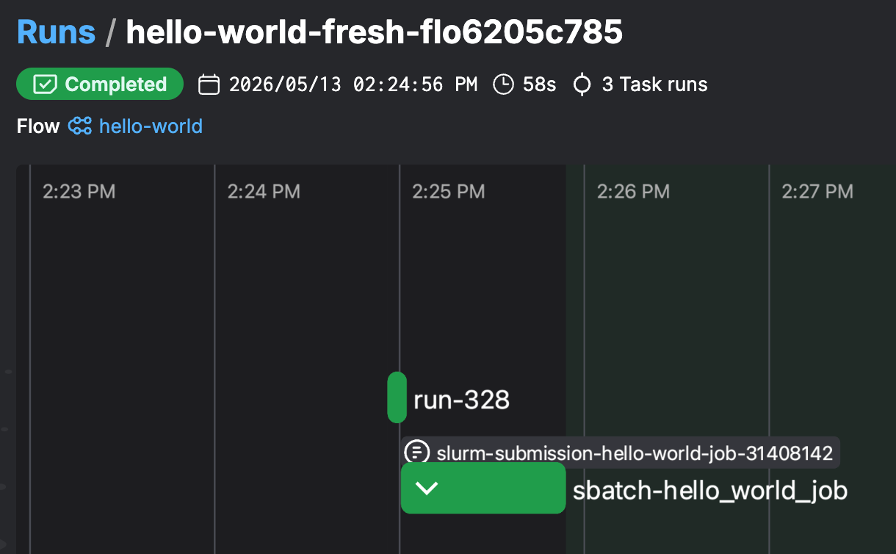

# hpc-relay

Run commands and [Slurm](https://slurm.schedmd.com/overview.html) jobs on HPCs from a [Prefect](https://www.prefect.io/) flow. One uniform Python API across EuroHPC and generic SSH/Slurm clusters, with resumable workflows that survive disconnections, shutdowns and transient errors.

**Status:** alpha (`0.1.0`). API is subject to change.

## Why this exists

Running long and complex workflows on HPCs is difficult out of the box:

- Every center has a different login flow (SSH keys, OTP, ...).
- Slurm has no concept of multi-step workflows, no UI, no hierarchy and no resumption.
- typical SSH sessions expire in hours; multi-day training jobs don't.
- If your driver script is interrupted, you lose track of which jobs already finished.
- HPCs have no common high-level orchestration solution. Using each HPC requires its own specific tool on top of Slurm - if one is available.

This package wraps Prefect's task/flow primitives so that:

- A single interface replaces ad-hoc SSH or API plumbing per HPC.
- `run(...)` and `sbatch(...)` are normal Python calls — Prefect provides the UI, retries, and scheduling.
- A `rerun_token` makes interrupted flows resumable: cached task results replay, in-flight Slurm jobs are *not* re-submitted.
- A single Prefect deployment can supervise hundreds of concurrent Slurm jobs across multiple HPCs without overwhelming any controller (smart polling).

## Two layered interfaces

The package is split into two independent layers; use whichever fits your stack.

1. **Low-level — `hpc_relay.cmd_runners`** — a Prefect-free abstraction over HPC communication. One small protocol (`CommandRunner.run(Command, logger) -> Result[CommandResult]`) and one context dataclass per center (`LocalContext`, `GenericContext`, `EcmwfSshContext`, `EcmwfEcaccessContext`, `CinecaSshContext`, `CscsFirecrestContext`). The async dispatcher `run_cmd(ctx, cmd, logger)` picks the right runner. This is the layer that solves the "how do I run a command on this HPC" problem and depends only on `paramiko` / `httpx` / `pyfirecrest` — no Prefect, no caching, no SLURM logic. Drop it into any orchestration framework, or use it directly from a script. See the contexts table below for the per-HPC matrix.

2. **High-level — `hpc_relay`** — Prefect-based Slurm orchestration built on top of layer (1). Adds `@flow` / `@task` decorators, `sbatch` / `sbatch_try` / `sbatch_submit` for SLURM job submission with monitoring, a leased per-HPC `sacct` poller, transactional submission caching, and `rerun_token`-driven resumability. Use this layer when you want resumable multi-job workflows with a UI; use only layer (1) when you just need to talk to an HPC.

The layers are independent in one direction: the Prefect layer imports from `cmd_runners`, but `cmd_runners` knows nothing about Prefect or SLURM. Adding a new HPC means writing one runner + one context in layer (1); the SLURM/Prefect layer picks it up for free.

## Quick start

You can try this package without installing anything on your machine. 

Prerequisites on your local machine:
- [uv](https://docs.astral.sh/uv/) ≥ 0.9
- A passwordless SSH connection to an HPC, e.g. `ssh hpc-login` returns a shell without prompts. 

**1. Start a local Prefect server**

Note: you do not need to install Prefect locally, `uv` will handle that.

```sh
uvx --with "prefect==3.7.0,fastapi<0.116,starlette<0.42,paramiko>=3.1" prefect server start
```

**2. Run the hello-world flow** ([source](https://github.com/tjhunter/hpc-relay/blob/main/examples/hello_world.py))

```sh
curl -fsSL https://raw.githubusercontent.com/tjhunter/hpc-relay/main/examples/hello_world.py | uv run --script -
```

The script connects to `hpc-login` over SSH, runs `echo 'hello world'` directly, then submits the same command as a Slurm job and waits for it to complete. If necessary, edit `working_directory` and the SSH host to match your environment.

**3. Open the UI** at <http://127.0.0.1:4200/flows> to see the run, task graph, logs, and the Slurm submission artifact:



Sample console output:

```text
14:24:56 | INFO | Flow run 'hello-world-fresh-flo6205c785' - Beginning flow run for flow 'hello-world'
14:24:56 | INFO | Flow run 'hello-world-fresh-flo6205c785' - Fresh run. To resume if interrupted, rerun with rerun_token='flo6205c785'.
14:24:56 | INFO | Task run 'run-328' - Running: ssh -o BatchMode=yes hpc-login 'echo hello world'
14:25:00 | INFO | Task run 'run-328' - Finished in state Completed()
```

## Install as a library

```sh
uv add "hpc-relay @ git+https://github.com/tjhunter/hpc-relay.git"
```

For local development against a sibling checkout:

```toml
[tool.uv.sources]
hpc-relay = { path = "../hpc-relay", editable = true }
```

## API surface

### Low-level: HPC communication (`hpc_relay.cmd_runners`)

Prefect-free. This is the layer to import if you just need to run commands on an HPC from arbitrary Python code.

| Symbol | What it does |
| --- | --- |
| `Command(command, working_directory=..., env_vars=...)` | Plain dataclass describing a command. |
| `CommandResult` | `{ stdout, stderr, return_code }`. |
| `CommandRunner` | Protocol: `run(Command, logger) -> Result[CommandResult]`. One implementation per HPC family. |
| `run_cmd(ctx, cmd, logger)` | Async dispatcher — picks the right runner for `ctx` and awaits its result. |
| `get_command_runner(ctx)` | Sync factory if you'd rather hold the runner yourself. |
| `slurm_account(ctx)` | Returns the SLURM account configured on the context, or `None`. |
| `LocalContext`, `GenericContext`, `EcmwfSshContext`, `EcmwfEcaccessContext`, `CinecaSshContext`, `CscsFirecrestContext` | One context dataclass per HPC family — see the contexts table below. |

HPC contexts:

| Context | Connection | Typical use |
| --- | --- | --- |
| `LocalContext()` | Local shell | Development, CI. |
| `SimpleSshContext(host=...)` | prefonfigured SSH | ECMWF HPC2020, etc. |
| `GenericContext(host=...)` | SSH | Any cluster reachable via passwordless SSH (providing options) |
| `EcmwfEcaccessContext(cert_path=...)` | ECaccess SOAP (cert auth) | ECMWF without an interactive SSH session. |
| `JscUnicoreContext(hpc=..., user=...)` | UNICORE | JSC (juwels, jupiter, jureca) |
| `CinecaSshContext(hpc=..., user=...)` | step-ca SSH cert | CINECA Leonardo. |
| `CscsFirecrestContext(hpc=..., consumer_key_path=..., consumer_secret_path=..., account=...)` | FirecREST v2 (OAuth2) | CSCS santis / clariden / alps. Survives well beyond an SSH session. |

### High-level: Prefect orchestration (`hpc_relay`)

All public symbols importable from the top-level package. Built on the low-level runners above.

| Symbol | What it does |
| --- | --- |
| `@flow` | Prefect flow decorator. Requires a `rerun_token: str \| None = None` parameter on the flow function (enforced at decoration time). |
| `@task` | Prefect task decorator. Cache keys include the `rerun_token`, so reruns replay successful tasks. |
| `run(ctx, command=...)` | Synchronous command on the HPC. Returns `CommandResult` (stdout/stderr/return_code); raises on transport errors. |
| `run_try(...)` | Same as `run`, but returns a `Result[CommandResult]` instead of raising. |
| `sbatch(ctx, job_name=..., command=..., time_limit=..., ...)` | Submit a Slurm job and block until it completes. Raises if the job ends in any non-`COMPLETED` state. |
| `sbatch_try(...)` | Same as `sbatch`, but returns a `Result[SlurmJobResult]`. |
| `sbatch_submit(...)` | Submit a Slurm job without waiting. Returns `SlurmSubmissionResult`. |
| `SlurmJobResult` | `{ job_id, status, submission }` for a completed job. |
| `get_run_logger()` | Prefect-aware logger inside tasks. |

## Resuming an interrupted flow

Every flow run prints a `rerun_token` at startup:

```
Fresh run. To resume if interrupted, rerun with rerun_token='flo6205c785'.
```

If the flow crashes or you Ctrl-C the driver, pass that token back in:

```python
hello_world(rerun_token="flo6205c785")
```

You can also use a token of your choice. All execution will 
be cached based on this token:

```python
hello_world(rerun_token="my_big_helloworld_expirement")
```

What replays vs. what doesn't:
- Tasks that already returned successfully → cached result, no work re-done.
- Slurm submissions that already happened → cached `SlurmSubmissionResult`; the job is *not* re-submitted. Monitoring resumes against the existing `job_id`.
- Tasks that raised exceptions → not cached; retried fresh.

## Supported HPCs


| Center                        | Context                | Session model                            | Notes                                                                                       |
| ----------------------------- | ---------------------- | ---------------------------------------- | ------------------------------------------------------------------------------------------- |
| ECMWF (HPC2020)               | `EcmwfSshContext`      | SSH (~2 days) / <br>ecaccess (7 days)    | `ecaccess` incomplete; jobs can take a few minutes to launch with ecaccess                  |
| CSCS (santis, clariden, alps) | `CscsFirecrestContext` | SSH (~ 2days) /<br>FirecREST (unlimited) | Preferred path for long workflows; see [CSCS docs](https://docs.cscs.ch/access/firecrest/). |
| Any cluster                   | `GenericContext`       | Passwordless SSH (~1–2 days)             | Suitable for JSC, CINECA, BSC, etc. — anything reachable via key-based SSH.                 |
| JSC (jupiter, juwels, jureca) |                        | SSH (12 hours) / UNICORE (unlimited)     |                                                                                             |
| BSC (Marenostrum5)            |                        | SSH (3-4 days)                           | No official interface for long-running sessions, use `GenericContext`                       |
| Cineca(leonardo)            |                        | SSH (4 days)                           | No official interface for long-running sessions, use `CinecaSshContext`                       |

**Never embed secrets directly in source** . All contexts can load secrets from disk. These secrets can be updated during computation, as they are regularly checked and reloaded.

### ECMWF-SSH

Works out of the box.

### ECMWF-ECACCESS

Get a certificate at https://boaccess.ecmwf.int/ecmwf/ecaccess > "Get certificate"

Store the certificate for example at `~/.ecaccess_cert.crt`

### CSCS-FirecREST

Get a consumer key and secret by following the instructions in:
https://docs.cscs.ch/access/firecrest

Copy and then store securely the certificates, for example in `~/.ssh/cscs_consumer_key` and `~/.ssh/cscs_consumer_secret` .

### JSC-UNICORE

You need a certificate. The easiest:

Open jupyter: https://jupyter.jsc.fz-juelich.de/hub/home

Run this code in a python notebook:

```py
import json, os, requests, urllib3
urllib3.disable_warnings(urllib3.exceptions.InsecureRequestWarning)
hub_api_url = os.getenv("JUPYTERHUB_API_URL")+"/user_oauth"
headers = {"Authorization": "token {}".format(os.getenv("JUPYTERHUB_API_TOKEN"))}
r = requests.get(hub_api_url, headers=headers, verify=False)
resp = json.loads(r.content.decode("utf-8"))
resp["auth_state"]["access_token"]
```

This gives you a short-lived token. Then run (for JUPITER)

```bash
./scripts/token_jsc.py --from-token - -u JUDOR_USER_NAME --lifetime 7776000 --site JUPITER 
```

This command will prompt you for copy/pasting the token
and will store it to `~/.jsc_unicore_token`.

## Examples

- [`examples/hello_world.py`](examples/hello_world.py) — minimal `run` + `sbatch` over SSH.
- [`examples/test_flow.py`](examples/test_flow.py) — parallel Slurm jobs with `.submit()`, switchable across SSH and FirecREST contexts.
- [`examples/test_flow_multihpc.py`](examples/test_flow_multihpc.py) — one flow spanning multiple HPCs.

## Non-goals

This package does **not**:
- Move data between HPCs (no rsync/staging abstraction).
- Manage interactive sessions (`salloc`, `srun --pty`).
- Provide Slurm job arrays or heterogeneous job groups.
- Replace Prefect — you still need a running Prefect server.

## Troubleshooting

- **Cached result replayed when you wanted a fresh run** — omit `rerun_token` (or pass `None`) to force a fresh cache key.
- **`sbatch` raises immediately** — check `working_directory` exists on the target HPC and that the account (`account="auto"` is the default) resolves correctly.
